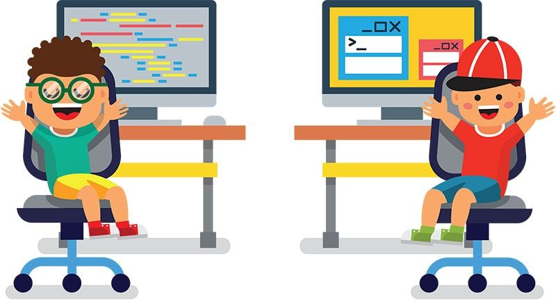

# Dein Einstieg ins Programmieren :tada:
Willkommen bei der Ismaninger Coding School

Unser Ziel ist, es Euch das Programmieren beizubringen und somit für die Informationstechnologie (IT) zu begeistern. Denn Coden ist cool und es gibt in der IT viele spannende Berufe!
# Unsere Kurse

## Programmiere deine ersten Spiele - mit einer Schlange :snake: ?

[_Python_](python.org) ist eine weitverbreitete und beliebte Programmiersprache, mit der Du schnell lernst wie du Dein erstes eigenes Program schreiben kannst!

👉 [zum Einsteigerkurs auf replit.com](https://replit.com/@DavidHeereman/Zahlenratespiel-interaktiv)

# Anmeldung zu geführten Coding Days

Regelmässig veranstalten wir 2-halb-tätige workshops - unsere _Coding Days_ . Dabei begleiten wir Euch in zwei halben Tagen (Sa/So 9:00 - 12:30) beim Erlernen der Grundkonzepte des Programmierens. Zum Ende des zweiten Tages seid ihr sogar schon in der Lage, Euer erstes eigenes Program zu schreiben - ein Zahlenratespiel zum Beispiel!

## Registrierung zum Kurs

👉 [Registrierungsformular 📋](mailto:coding.ismaning@gmail.com?Subject=Anmeldung%20zu%20Coding%20Days&Body=Name%20des%20Kindes:%0D%0AAlter%20des%20Kindes:%0D%0ASchule:)
# Info
##### 🇩🇪
Lorem ipsum dolor sit amet, consectetur adipiscing elit. Vivamus sed pharetra quam. Aenean viverra eros non vehicula pellentesque. Donec turpis dolor, tempor vel cursus convallis, lobortis sed leo. Aliquam sodales ipsum sed augue vulputate, sit amet vehicula quam eleifend.
##### 🇬🇧
Nullam velit odio, consequat eu tincidunt ullamcorper, mollis ut enim. Aenean mattis nec urna et tempus. Pellentesque a convallis nisi. Pellentesque habitant morbi tristique senectus et netus et malesuada fames ac turpis egestas. Phasellus vel odio a metus iaculis fermentum blandit ut purus.
##### 🇷🇺
Curabitur luctus lacus et nulla mollis, eu posuere mi iaculis. Nunc ultrices mauris sit amet imperdiet vehicula.
# Galerie

# About
Donec et est euismod, porta elit non, egestas sapien. Phasellus faucibus risus vel turpis posuere lacinia. Morbi dignissim ex nec congue tempus. Etiam consectetur urna in urna dapibus, a mollis arcu dictum. In maximus feugiat semper. Duis sit amet tempor nibh. Pellentesque eu purus convallis, finibus eros vel, porta lacus. Aliquam viverra justo diam, non auctor eros finibus vel. Vestibulum ultrices odio porttitor auctor venenatis. Aliquam erat volutpat. Fusce at magna massa. Donec non tellus laoreet, mollis erat at, viverra neque. Fusce pellentesque lorem orci, et rutrum ligula sodales a. In ac vehicula mauris, vel fermentum risus. Morbi malesuada condimentum justo ac imperdiet.
##### Die Tutoren

##### Der Verein

# Kontakt

# Impressum
Donec et est euismod, porta elit non, egestas sapien. Phasellus faucibus risus vel turpis posuere lacinia. Morbi dignissim ex nec congue tempus. Etiam consectetur urna in urna dapibus, a mollis arcu dictum. In maximus feugiat semper. Duis sit amet tempor nibh. Pellentesque eu purus convallis, finibus eros vel, porta lacus. Aliquam viverra justo diam, non auctor eros finibus vel. Vestibulum ultrices odio porttitor auctor venenatis. Aliquam erat volutpat. Fusce at magna massa. Donec non tellus laoreet, mollis erat at, viverra neque. Fusce pellentesque lorem orci, et rutrum ligula sodales a. In ac vehicula mauris, vel fermentum risus. Morbi malesuada condimentum justo ac imperdiet.
